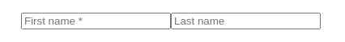

# NgxPlaceholderAsterisk

Simple directive to add asterisk followed by space (' \*') to input placeholder programatically

## Installation

```
npm install ngx-asterisk-placeholder --save
```

## Usage

1. Add module:

```
imports: [
    // ...
    AsteriskPlaceholderModule
  ],
```

2. Use `asteriskPlaceholder` directive on `input` field - below it is used on only one (frist) of two inputs:

```
<input type="text" asteriskPlaceholder placeholder="First name">
<input type="text" placeholder="Last name">
```

3. See results - first one has asterisk added:



## Development

Development follows guide on Angular.io - https://angular.io/guide/creating-libraries

### Build

Run `npm run build` to build the project. The build artifacts will be stored in the `dist/ngx-asterisk-placeholder` directory.

## Contribute

Are you interested in contributing? Awesome! Fork, make change, commit and create pull request. I'll do my best to merge
changes!

## License

[MIT](/LICENSE)
